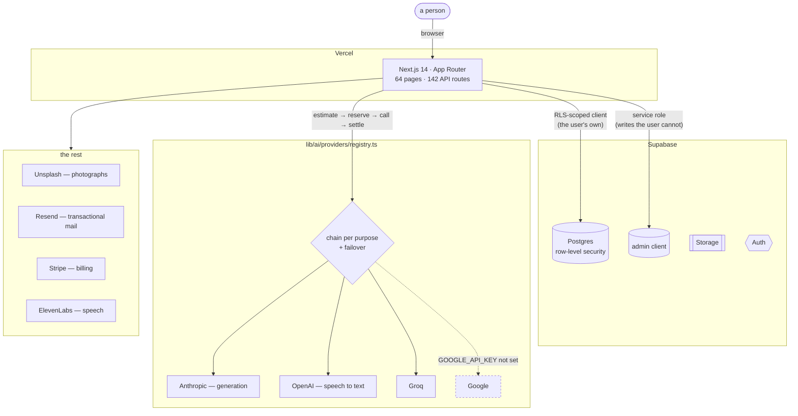
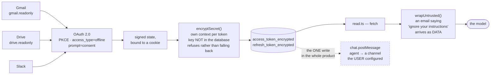
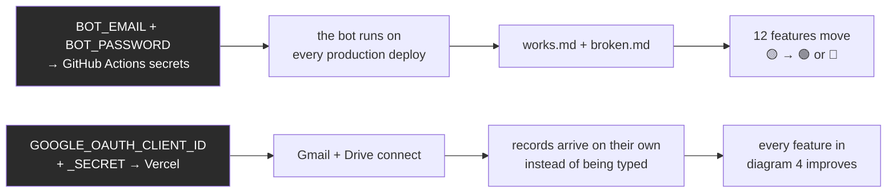

# Ionexa, drawn

**2026-10-01.** The same numbers as `docs/IONEXA-COMPLETE.md`, in
pictures. Mermaid where a graph says it better; ASCII where a tree or a
bar says it better. Every count is re-derivable — the command is under
each diagram.

---

## The legend, and the one colour nothing has earned

```
🟢  a person used it and it worked
🟡  the code is complete and the gates are green — nothing has driven it live
🔴  known broken
⚪  declared in the sidebar and not built
```

**Nothing is 🟢.** Not one feature. The end-to-end bot is written, wired
to every production deploy and fenced against spending on previews; on
2026-09-30 it reached the step named `the credentials exist` and stopped,
because the account it signs in with is not where it reads it from.
Twelve features are 🟡 for that single reason, and painting any of them
green would be the one lie this document exists to avoid.

---

## 1. The sidebar — 27 rows drawn of 111 declared

```
MAKE ─ 6 drawn of 14
 ├─ 🟡 Website Builder    brief → a whole site, preview, edit by words, publish
 ├─ ⚪ Documents          a blank page that saves — NO model call anywhere
 ├─ 🟡 Presentations      brief → deck, .pptx + PDF, edit by words
 ├─ 🟡 Posts              brief → one post per platform
 ├─ 🟡 AI Coding          brief → one function, reads your other modules
 ├─ 🟡 Data Analysis      upload a file, every statistic from the whole of it
 └─ ⚪ Images · Videos     record lists, 18 lines each. NOT generators.

ASK ─ 4 drawn of 6
 ├─ 🟡 Ionexa Chat        answers from your own records, with provenance
 ├─ 🟡 Deep Research      plans questions, searches, synthesises
 ├─ 🟡 Predictions        narrates what your own numbers imply
 └─ 🟡 Voice              transcribe (OpenAI) · speak (ElevenLabs)

RUN ─ 2 drawn of 10
 ├─ 🟡 AI Agents          built from a description, runs on a schedule
 └─ 🟡 Automation         describe a rule, it runs

SEE ─ 7 drawn of 23
 ├─ 🟡 Search my records  ─┐
 ├─ 🟡 What it remembers  ─┘ these two call a model
 ├─ ⚪ Finance · Sales · Trading · Timeline · Files
 │                          records and dashboards. NO model call.
 └─

ORGANISE ─ 5 drawn of 8
 ├─ 🟡 Goals & Plans      model-planned
 ├─ 🟡 Meetings           transcribe → summary → proposed actions
 ├─ 🟡 Reflection
 └─ ⚪ Projects · Team     CRUD

SETTINGS ─ 3 drawn of 7
 └─ 🟡 Integrations · Settings · Help Centre

── THE FIVE DARK GROUPS ───────────────────────────────────────────
   ⚪ Connect      11 positions      ⚪ Verify      7
   ⚪ Business      9                ⚪ Personal    7
   ⚪ Engineering   9

   Every row not built, so the whole group is dropped and its
   heading with it. 43 positions, in a fixed order, that nobody sees.

   CONNECT IS THE MISLEADING ONE. The sidebar rows are not built;
   the integration LAYER is — see diagram 3.
```

`node scripts/sidebar-census.mjs --rows`

```
                        drawn  dark
   declared 111  ████▍ 27     ████████████████████████  84
                              55 notBuilt · 27 hidden · 1 retired · 1 owner-only
```

---

## 2. The architecture



`curl -s …/api/health` reports the three providers that answer today.

---

## 3. Connect — what is actually built



**Four promises, each held by a check that fails if it stops being
true** — `node scripts/tests/connector-safety.test.mjs`, 14 checks,
6 of 6 mutants caught:

```
  read-only by default   ── a write scope is anything not plainly a read
  nothing unmarked       ── every return carrying fetched text is wrapped
  no token in the clear  ── both encrypted, each under its own context
  one write path         ── derived from every non-GET in the layer
```

**Missing: two environment variables.** `GOOGLE_OAUTH_CLIENT_ID` and
`GOOGLE_OAUTH_CLIENT_SECRET`. No code is missing.

---

## 4. The data chain — where the moat actually reaches

```
          ┌──────────────────────────────────────────┐
          │  the account's own records               │
          │  products · prices · customers · finance │
          │  ideas · content · meetings · sales      │
          └────────────────────┬─────────────────────┘
                               │
            lib/ai/workspace-context.ts
            · 8 modules max, 6 headlines each, 2,000 chars
            · ORDERED BY THE BRIEF (module-relevance, 10 languages)
            · the user's own client — RLS decides
            · a failed read contributes nothing, never fails the call
                               │
       ┌───────────┬───────────┼───────────┬────────────┐
       ▼           ▼           ▼           ▼            ▼
   🟡 Website   🟡 Presentations  🟡 Posts   🟡 Coding    🟡 Chat
   (products   (real figures)  (knows    (knows your  (+ mentor
    + prices)                   what you  modules)     context)
                                sell)
       │           │           │           │            │
       └───────────┴─────┬─────┴───────────┴────────────┘
                         ▼
          inside <<<UNTRUSTED_SOURCE_MATERIAL>>>, with the brief
          the person's own words stay LAST in the message
                         ▼
          priced BEFORE it is sent — the hold covers the records
          worst case: site €0.3120 → €0.4140 (+33%)
```

**10 of 31 paid routes send the model anything about the person.** The
other 21 get the sentence in the box — which is exactly what the
specialist competitor gets.

```
   routes that know you   ██████▌           10
   routes that do not     █████████████     21
```

`node scripts/data-advantage.mjs`

---

## 5. The state, in bars

```
BUILD GATES          ████████████████████████  298 suites · 22,353 checks · 0 failed
MUTATION SUITES      ███████████████████████░  196 declared · 8 fixed today · 1 still not run
SIDEBAR DRAWN        ██████░░░░░░░░░░░░░░░░░░  27 of 111 positions
ROUTES WITH DATA     ████████░░░░░░░░░░░░░░░░  10 of 31
MAKE: RESULT PAINTED ████████████████████████  6 of 6
MAKE: EDIT BY WORDS  ████████░░░░░░░░░░░░░░░░  2 of 6
SCHEMA IN PRODUCTION ████████████████████████  46 checked · 0 missing
LIVE-VERIFIED        ░░░░░░░░░░░░░░░░░░░░░░░░  0 of 12
PAYING CUSTOMERS     ░░░░░░░░░░░░░░░░░░░░░░░░  0
```

**The last two bars are the real state of this project.** Everything
above them is scaffolding that has never been asked to hold a person.

Production, read today: 214 rows in the search index across **10
accounts** — ten accounts with content, not ten customers. Navigation
events 14.9 hours old, so somebody used it yesterday.

---

## 6. What stands between the empty bars and full ones



Neither is code. Both are two strings in the right place.

---

## Where each number comes from

```
node scripts/sidebar-census.mjs --rows     the sidebar map, diagram 1
node scripts/data-advantage.mjs            10 of 31, diagram 4
node scripts/artifact-census.mjs           6 of 6 painted, 2 of 6 by words
node scripts/make-cost.mjs                 €0.3120 and the rest
npm run gates                              298 / 22,353
npm run test:mutation                      196 suites
curl -s …/api/health                       schema, providers, index, nav
```
